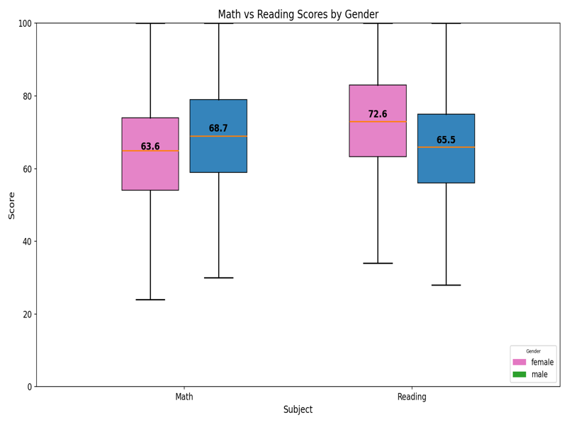
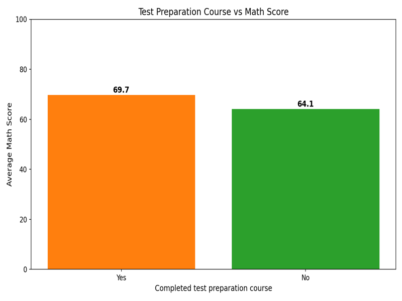
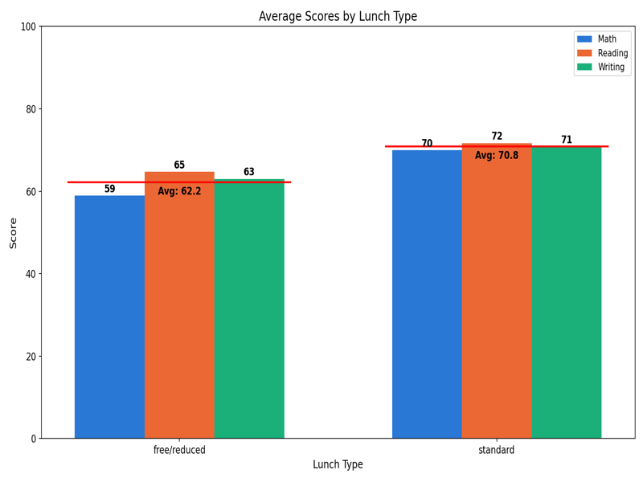
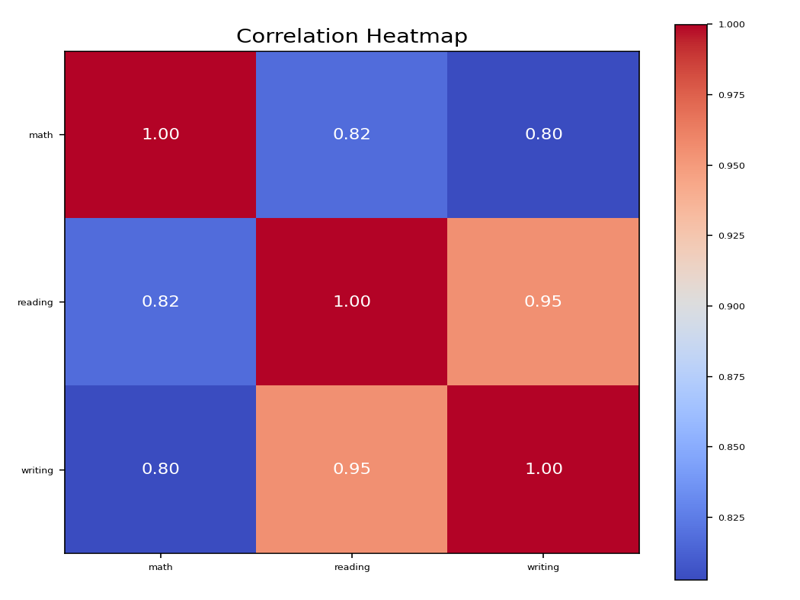
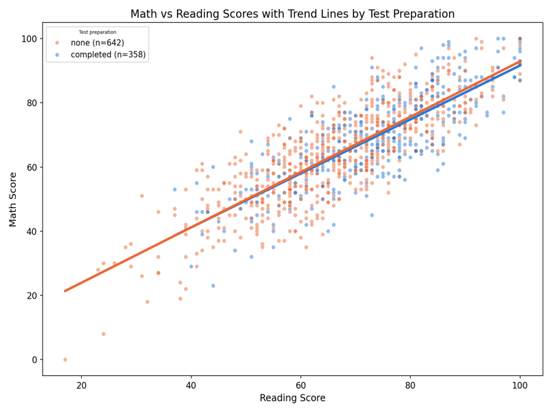

# Q2 - Students Performance: Findings

Rows analyzed: 1000 (out of 1000 raw rows). 0 rows were dropped for missing values, duplicates, or out-of-range scores; this dataset happened to have none of those problems.

## V1 - Gender boxplots (math vs reading)

Males score a little higher in math on average and females score a little higher in reading. Neither gender leads in both subjects, so this looks like a trade-off rather than one group doing better overall. The boxes also show a wide spread of scores inside each gender, which is bigger than the gap between the two gender averages.

## V2 - Test prep impact on math

Students who completed the test preparation course score about 5.6 points higher in math on average than students who did not. This suggests the course is associated with better math performance, although students who choose to prepare may also differ from other students in other ways.

## V3 - Lunch type and average performance

Students with standard lunch score about 8.6 points higher overall than students with free/reduced lunch, and this holds in all three subjects, not just one. Lunch type is often used as a rough stand-in for family income, so this gap may reflect wider differences in resources rather than lunch itself.

## V4 - Subject correlations

All three subjects move together: the correlation numbers range from 0.80 to 0.95, all positive, meaning a student who scores high in one subject tends to score high in the others too. Reading and writing are the most closely linked pair.

## V5 - Math vs reading with trend lines by test prep

Math and reading scores rise together for both groups, and the two trend lines follow a very similar path across the reading range. The completed-prep line sits a bit above the other one, so test-prep students tend to score higher in math at a given reading level, not just because they read better.

## Conclusion

Test preparation and lunch type (a rough proxy for family income) are both associated with higher scores, with the lunch gap being the larger of the two. The three subjects rise and fall together, especially reading and writing. These are patterns in observational data, not proof that any one factor causes another.
